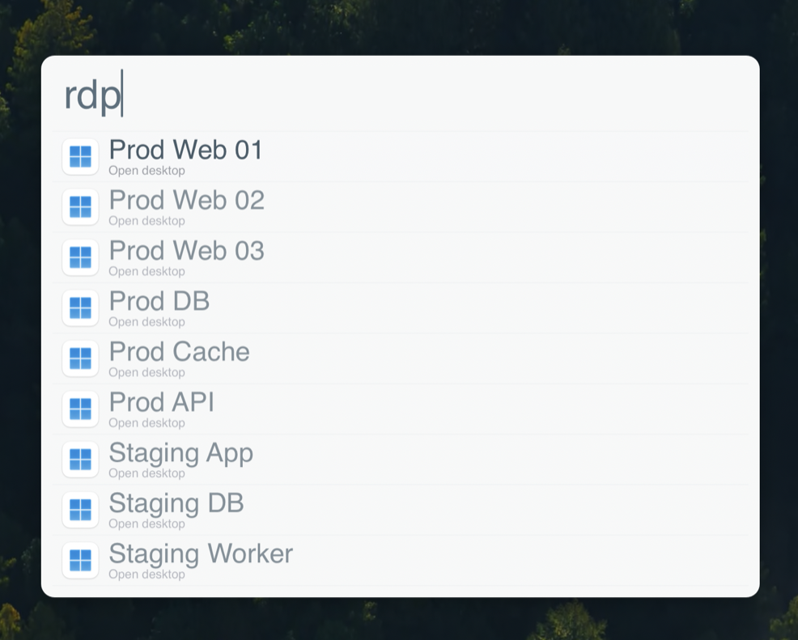

# alfred-windows-app
Simple Alfred workflow to search and open saved bookmarks from [Windows App](https://apps.apple.com/us/app/windows-app/id1295203466) — Microsoft's macOS remote desktop client, formerly named *Microsoft Remote Desktop*. Based on https://github.com/ctwise/alfred-workflows/tree/master/remote-desktop

**Requires [Alfred](https://www.alfredapp.com/) with the Powerpack, and Windows App installed in `/Applications`.**

<p align="center">
  
</p>

## Usage
Trigger Alfred and use the `rdp` keyword:
- `rdp ` — list every saved bookmark.
- `rdp <name>` — filter bookmarks whose name contains `<name>`.

Select a result and press Enter to open the session in Windows App.

## Why?
The version in the source repository was no longer maintained and no longer functional. It also relied on `osascript` to bring Microsoft Remote Desktop to the foreground and simulate keypresses to open a session, which did not always work reliably. This workflow instead drives Windows App through its [command line interface](https://learn.microsoft.com/en-us/windows-app/cli-macos), which exposes the same `--script bookmark` commands the old app used.

## How?
Two parts:
- [`list_desktops.rb`](list_desktops.rb): Accepts one argument, the search query, and runs `--script bookmark list` to get the saved bookmarks as CSV. It filters by query and returns matches to Alfred via [`alfred_feedback.rb`](alfred_feedback.rb), letting you search through your bookmarks. An empty query returns every bookmark, so the keyword alone lists them all.
- [`open_desktop.rb`](open_desktop.rb): Accepts one argument, the ID of the selected bookmark, and runs `--script bookmark export <id> --uri` to get the `rdp://` URI. It then `open`s the URI and Windows App launches the session.

## Todo:

- Add testing/linting

## Installation
Download the latest [`Windows-App.alfredworkflow`](https://github.com/thanegill/alfred-windows-app/releases/latest) and double-click it to import into Alfred. It runs on the system Ruby that ships with macOS, so there's nothing to build.

## Demo data
Both scripts read the Windows App binary path from the `WINDOWS_APP` environment variable, defaulting to `/Applications/Windows App.app/Contents/MacOS/Windows App`. Point it at any executable that speaks the same `--script bookmark` interface.

[`test/fake-windows-app`](test/fake-windows-app) is such a stand-in: it returns a fixed set of fake bookmarks, so you can demo or screenshot the workflow without exposing your real desktops. To use it, set `WINDOWS_APP` to its absolute path — either inline:

```sh
WINDOWS_APP="$PWD/test/fake-windows-app" ruby list_desktops.rb prod
```

or, to drive Alfred itself, add it under the workflow's **Configuration → Workflow Environment Variables** in Alfred, then remove it when you're done.
